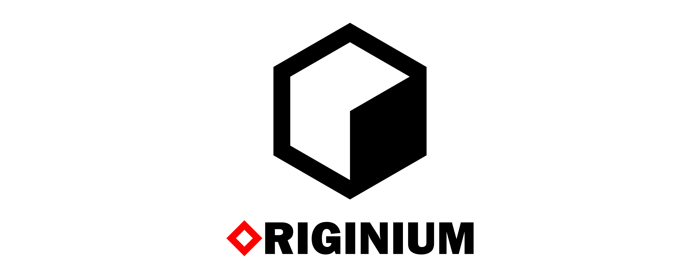

LSM-Tree based storage engine used by FOIVER system.

## Install

```shell
go get -u github.com/B1NARY-GR0UP/originium
```

## Usage

### Opening a Database

```go
package main

import (
    "log"

    "github.com/B1NARY-GR0UP/originium"
)

func main() {
    // Use originium.Config to customize your db behavior
    db, err := originium.Open("your-dir", originium.DefaultConfig)
    if err != nil {
        log.Fatal(err)
    }

    defer db.Close()

    // ...
}
```

### Transactions

ORIGINIUM supports concurrent ACID transactions with Serializable Snapshot Isolation (SSI) guarantees.

- Read-only transaction

```go
err := db.View(func(txn *originium.Txn) error {
    // ...

    res, ok := txn.Get("hello")
    if !ok {
        // key not found
    }

    // ...
    return nil
})
```

- Read-write transaction

```go
err := db.Update(func(txn *originium.Txn) error {
    // ...

    if err := txn.Set("hello", []byte("originium")); err != nil {
        return err
    }

    // ...
    return nil
})
```

- Manually

```go
// start a read-write transaction manually
txn := db.Begin(true)
defer txn.Discard()

// ...

if err := txn.Delete("hello"); err != nil {
    return err
}

// ...

if err := txn.Commit(); err != nil {
    return err
}
```

## Blogs

- [How to Implement Serializable Snapshot Isolation for Transactions](https://dev.to/justlorain/how-to-implement-serializable-snapshot-isolation-for-transactions-4j38)
- [Building an LSM-Tree Storage Engine from Scratch](https://dev.to/justlorain/building-an-lsm-tree-storage-engine-from-scratch-3eom)

## Credits

Sincere appreciation to the following repositories that made the development of ORIGINIUM possible.

- [badger](https://github.com/hypermodeinc/badger)
- [compress](https://github.com/klauspost/compress)
- [frugal](https://github.com/cloudwego/frugal)
- [murmur3](https://github.com/spaolacci/murmur3)
- [testify](https://github.com/stretchr/testify)
- [thrift](https://github.com/apache/thrift)

## License

ORIGINIUM is distributed under the [Apache License 2.0](./LICENSE). The licenses of third party dependencies of ORIGINIUM are explained [here](./licenses).

## ECOLOGY

<p align="center">

<br/><br/>
ORIGINIUM is Part of <a href="https://github.com/B1NARY-GR0UP">PROJECT: FOIVER</a>
</p>
